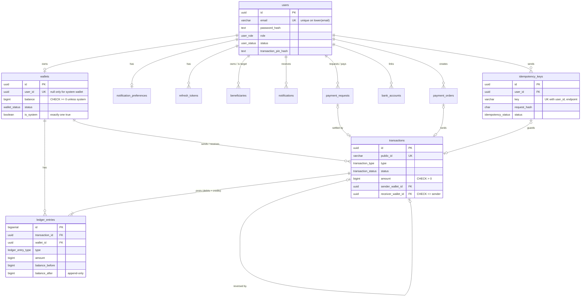

# CoinHub entity relationship diagram

```mermaid
erDiagram
  users ||--o| wallets : owns
  users ||--o| notification_preferences : has
  users ||--o{ refresh_tokens : has
  users ||--o{ beneficiaries : "owns / is target"
  users ||--o{ notifications : receives
  users ||--o{ payment_orders : creates
  users ||--o{ bank_accounts : links
  users ||--o{ idempotency_keys : sends
  users ||--o{ payment_requests : "requests / pays"
  wallets ||--o{ ledger_entries : "has"
  wallets ||--o{ transactions : "sends / receives"
  transactions ||--|{ ledger_entries : "posts (debits = credits)"
  payment_requests |o--o| transactions : "settled by"
  payment_orders |o--o| transactions : "funds"
  transactions |o--o| transactions : "reversed by"
  idempotency_keys |o--o| transactions : "guards"

  users { uuid id PK
    varchar email UK "unique on lower(email)"
    text password_hash
    user_role role
    user_status status
    text transaction_pin_hash }
  wallets { uuid id PK
    uuid user_id UK "null only for system wallet"
    bigint balance "CHECK >= 0 unless system"
    wallet_status status
    boolean is_system "exactly one true" }
  transactions { uuid id PK
    varchar public_id UK
    transaction_type type
    transaction_status status
    bigint amount "CHECK > 0"
    uuid sender_wallet_id FK
    uuid receiver_wallet_id FK "CHECK <> sender" }
  ledger_entries { bigserial id PK
    uuid transaction_id FK
    uuid wallet_id FK
    ledger_entry_type type
    bigint amount
    bigint balance_before
    bigint balance_after "append-only" }
  idempotency_keys { uuid id PK
    uuid user_id FK
    varchar key "UK with user_id, endpoint"
    char request_hash
    idempotency_status status }
```
